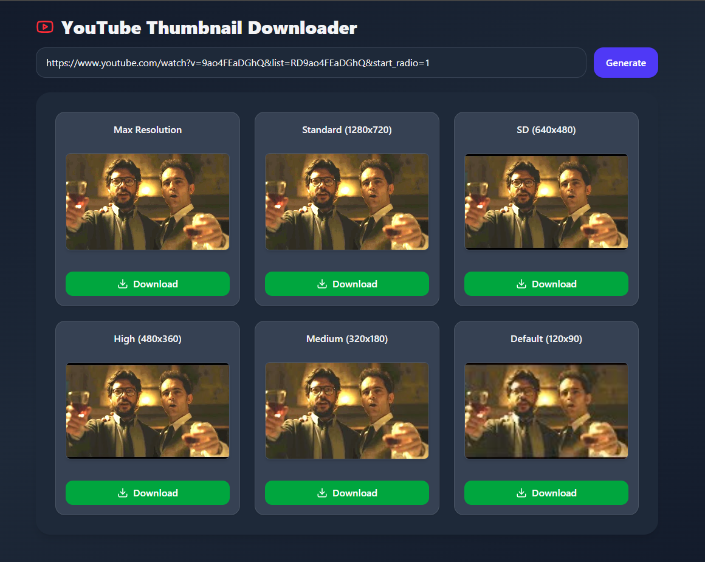

# 🎬 YouTube Thumbnail Downloader  
**Day 2 of 100 Days of React Challenge**  

This project is part of my **100 Days of React Challenge**.  
On Day 2, I built a **YouTube Thumbnail Downloader** app using **React, TailwindCSS, Framer Motion, Lucide Icons, and React Hot Toast**.  

---

## 📌 Features
- 🎨 Modern, responsive **dark-themed UI** with a gradient background.  
- 🔗 Paste a YouTube URL and instantly fetch thumbnails of **multiple resolutions**.  
- 🖼️ Uniform cards with preview images.  
- ⚠️ Handles cases where thumbnails are not available (shows a fallback).  
- 📥 Download thumbnails directly with a single click.  
- ✅ Error handling with elegant toast notifications.  
- ⚡ Smooth animations with **Framer Motion**.  

---

## 📸 Preview


---

## 🚀 Tech Stack
- **React.js** (Frontend Framework)  
- **TailwindCSS** (Styling)  
- **Framer Motion** (Animations)  
- **Lucide React Icons**  
- **React Hot Toast** (Error notifications)  

---

## ⚡ How to Run Locally
1. Clone the repository (main repo of 100 days challenge):
   ```bash
   git clone https://github.com/<your-username>/100-days-of-react.git
   cd 100-days-of-react/day-2-youtube-thumbnail-downloader

2. Install dependencies:
   ```bash
   npm install

3. Start the development server:
   ```bash
   npm run dev

4. Open http://localhost:5173 in your browser.