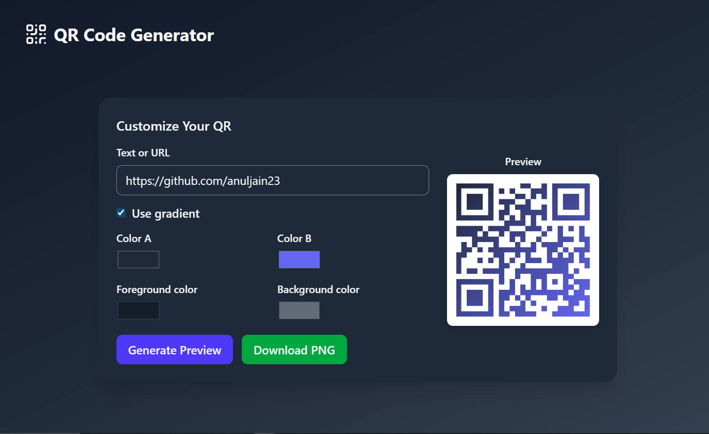

# 📱 Day 4: QR Code Generator (100 Days of React)

This is **Day 4** of my **100 Days of React Challenge**.  
Today’s project is a **QR Code Generator** where users can generate customizable QR codes with gradients, solid colors. The generated QR can be **previewed and downloaded** as a PNG.

---

## 🚀 Features
- Generate QR codes from **any text or URL**.
- Option to use **gradient colors** 🎨 or **solid foreground/background**.
- Real-time **preview** of generated QR code.
- **Download QR** as PNG with a single click.
- Gradient QR codes are rendered on a **white background** for better visibility.
- Responsive and modern **dark-themed UI**.

---

## 📸 Preview


---

## 🛠️ Tech Stack
- **React.js**
- **Tailwind CSS** (for styling)
- **Lucide Icons**
- **react-hot-toast** (for error and success messages)
- **GoQR API** (QR code generation)

---

## ⚡ How to Run
1. Clone this repo or navigate into the **day-04-qr-code-generator** folder.

2. Install dependencies:
   ```bash
   npm install

3. Start the development server:
   ```bash
   npm run dev

4. Open http://localhost:5173 in your browser.