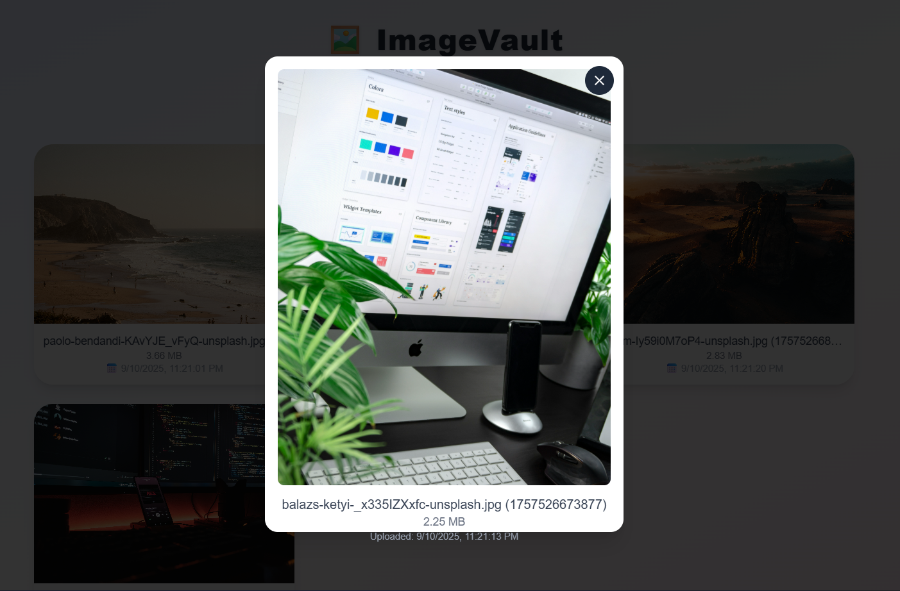

# 🖼️ Day 5: ImageVault (100 Days of React)


This is **Day 5** of my **100 Days of React Challenge**.
Today’s project is **ImageVault**, a simple yet elegant **image upload, preview, and storage app** that persists your uploads in local storage.


---


## 🚀 Features
- Upload images from your local device.
- View uploaded images in a beautiful **responsive grid**.
- See **file name, size, and upload date**.
- **Click an image** to view it in a full-screen preview modal.
- **Remove images** individually.
- Images persist even after page refresh (thanks to Zustand's `persist` middleware).


---


## 📸 Preview



---


## 🛠️ Tech Stack
- **React.js**
- **Tailwind CSS** (for styling)
- **Zustand** (state management + persistence)
- **Lucide React** (icons)
- **React-Toastify** (for notifications)
- **Animate.css** (for smooth animations)


---


## ⚡ How to Run
1. Clone this repo or navigate into the **image-vault** folder.


2. Install dependencies:
```bash
npm install
```


3. Start the development server:
```bash
npm run dev
```


4. Open **http://localhost:5173** in your browser.
