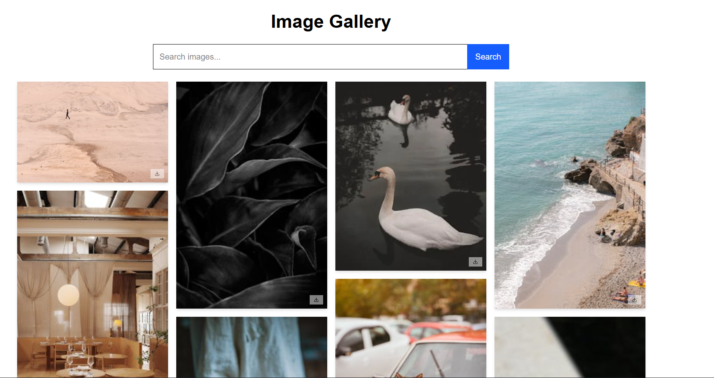

# 🖼️ Day 6: Image Gallery (100 Days of React)


This is **Day 6** of my **100 Days of React Challenge**.
Today's project is **Image Gallery**, a sleek and responsive **image search app powered by the Pexels API** with infinite scrolling.

---


## 🚀 Features
- Search images from the Pexels library.
- **Infinite scroll** — loads more images as you scroll.
- Smooth **loading indicators** for better UX.
- **Download button** for high-resolution images.
- **Remove images** individually.
- **Masonry-style** responsive layout with Framer Motion animations.


---


## 📸 Preview



---


## 🛠️ Tech Stack
- **React.js** (frontend framework)
- **Tailwind CSS** (styling)
- **Framer Motion** (animations)
- **Lucide React** (icons)
- **Pexels API** (image source)


---


## ⚡ How to Run
1. Clone this repo or navigate into the **image-gallery** folder.


2. Install dependencies:
```bash
npm install
```


3. Add your **Pexels API** Key in a .env file:
```bash
VITE_PEXELS_API_KEY=your_api_key_here
```


4. Start the development server:
```bash
npm run dev
```


5. Open **http://localhost:5173** in your browser.
